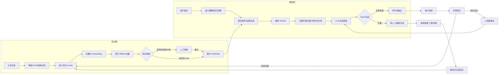

# 领域画像:企业级 AI 客服知识库系统

> 面向零基础读者的行业科普。用途:让不懂技术、不懂客服行业的人,也能看懂"我们要做一个什么样的系统"。

---

## 1. 行业科普

**这个行业在做什么?** 每一家做产品/服务的企业,都会收到大量客户提问,比如"我这个手机屏幕碎了能保修吗""退款几天到账""我的快递到哪了"。以前这些提问靠人工客服一条条回答,成本高、速度慢、半夜没人接。**AI 客服系统**就是让"机器人"来回答这些提问,而"知识库"就是机器人的"大脑资料库"——把企业的产品手册、售后政策、价目表、常见问题等所有资料,整理成机器人能读懂的格式存起来,提问时从里面找答案。

**它怎么运转?** 可以把它想成一位"新来的客服实习生"配了一个"超级资料库":
1. **喂资料**:管理员把 PDF、Word、Excel 等原始文档上传,系统自动解析、切分成小片段(Chunk)、并给每个片段做"语义指纹"(向量),存进数据库——这一步叫**知识入库**;
2. **找答案**:客户提问时,系统先听懂问题(识别意图,如"想保修"),再去资料库检索最相关的片段,经过排序、去重、核对,挑出"证据";
3. **写答案**:把"问题 + 证据"一起交给大模型(LLM)写回复,并且**强制要求答案必须引用证据编号**——没证据支撑的话,宁可转人工也不许乱编(防止"幻觉",即一本正经说瞎话);
4. **不断变好**:每次回答后收集客户反馈,定期用"标准考题"评测系统答得准不准,发现问题就改进知识库或提示词,再重新考试,直到达标才能上线新版本。

**系统在这个行业里扮演什么角色?** 它不是"一个聊天窗口",而是**企业的服务中台**:对外接客服坐席工作台、企业微信、钉钉、网页、APP 等渠道;对内连订单、物流、CRM 等业务系统(查单、创建工单、走退款审批);同时承担知识管理、质量评测、权限审计、成本核算等治理职能。一句话:**知识 → 检索 → 证据 → 生成 → 评测 → 治理** 形成完整闭环。

**为什么必须做"闭环"而不是只做个聊天机器人?** 行业实践表明:AI 答错的根因 80% 不在模型本身,而在"资料切分不合理、检索召回不准、答案生成不受约束"三个环节;同时,缺乏反馈与评测机制的客服系统会"越答越偏"。所以本系统把**入库、问答、转人工、评测、反馈、治理**全部打通成闭环,让每次失误都能被追踪、被修正、被防止重犯。

> 本画像的核心架构依据来自用户上传文档《AI客服知识库系统.docx》(企业级技术架构与平台划分),行业通用做法来自联网调研(见第 5 节)。

## 2. 业务全景图

### 2.1 角色地图

| 角色 | 职责 | 使用系统的核心场景 |
|------|------|-------------------|
| **终端客户** | 咨询产品/售后/物流/退款等问题 | 通过企业微信/网页/APP 提问,获得 AI 或人工回答 |
| **客服坐席** | 处理客户问题,重点接管 AI 搞不定的 | 打开对话工作台,查看 AI 建议与证据,一键采纳/转人工/创建工单 |
| **知识管理员** | 维护知识库内容 | 上传文档、查看入库状态、编辑 Chunk、处理审核 |
| **审核员(主管/法务/财务)** | 对高敏感知识做人工把关 | 在审核台通过/驳回 AI 抽取的条款、价格、政策 |
| **质检/评测人员** | 保证 AI 回答质量 | 维护标准考题集、跑评测、看指标、把关上线 |
| **平台管理员** | 权限、模型、成本、审计 | 配置角色权限、模型网关、预算与告警、查审计日志 |

角色协作关系:知识管理员/审核员保证"资料库"正确 → 客服坐席与 AI 协作应答客户 → 质检人员通过评测保证质量 → 平台管理员保证安全合规与成本。

### 2.2 核心流程全景(Mermaid)

> 📌 **渲染说明**:若当前编辑器未渲染此图,请直接阅读下方「图内流程的文字版」;或把代码粘贴到 [mermaid.live](https://mermaid.live) 查看。

**图内流程的文字版(一条主线看懂全系统)**:

- **知识侧(喂资料)**:上传文档 → 解析/OCR/结构识别 → 语义切分 → 向量化 → 建立 BM25+向量索引 → 知识审核(高风险政策/价格 → 人工审核;低风险 FAQ → 自动)→ 发布 Published
- **服务侧(答问题)**:客户提问 → 语义理解/改写/拆解 → 混合检索+权限过滤 → 重排 → 证据引擎(去重/冲突/充分性)→ LLM 生成 → Claim 验证 → 全部有据 → 带引用输出;无据 → 转人工/重新生成
- **持续变好(反馈)**:带引用输出 → 用户反馈 → 评测回归 → 发现问题 → 回到切分/知识侧修复;指标达标 → 上线新版本 → 影响 LLM 生成
- **人工兜底**:转人工 → 坐席接管/工单/流程 → 解决并沉淀知识 → 沉淀内容重新进入知识侧(闭环③⑦)

### 2.3 模块地图(八大闭环能力)

| 模块 | 解决什么问题 | 主要功能点 | 标配/选配 |
|------|-------------|-----------|-----------|
| **① 知识平台** | 企业资料杂乱,机器人看不懂 | 文档上传、解析(PDF/Word/Excel/PPT/扫描件OCR)、结构识别、语义切分、向量化、索引入库、Chunk 编辑 | 标配 |
| **② 知识治理** | 政策老改、AI 用到过期或错误版本 | 版本管理(草稿→审核→发布→过期→归档)、分级审核、冲突检测与裁决 | 标配 |
| **③ 检索平台** | 问得绕、问得长,直接搜搜不准 | 语义理解、Query 改写、复杂问题拆解、BM25+向量混合检索、重排、权限过滤 | 标配 |
| **④ 证据平台** | AI 一本正经地胡说八道 | 证据组装、去重、冲突检测、充分性判断、Claim 逐句验证、引用标注 | 标配 |
| **⑤ 对话工作台** | 客户与坐席都要好用 | 多渠道接入、AI 建议与证据面板、一键采纳、转人工、坐席接管、客户画像 | 标配 |
| **⑥ AI 运行时** | 模型五花八门、接口乱、成本失控 | 模型网关(路由/降级/限流/计量)、Prompt 管理与灰度 | 标配 |
| **⑦ Agent·流程** | AI 想越权动业务(查单/退款/工单) | 工具注册表(读/写分级)、权限边界、规则引擎、退款/换机等业务流程、操作留痕 | 标配 |
| **⑧ 评测与治理** | 质量没底、权限混乱、没法审计 | 标准考题集、自动评测(Recall@K/NDCG/幻觉率)、上线闸门、RBAC/ABAC、审计日志、模型成本、多租户 | 标配 |

## 3. 法规与合规约束清单

| 约束 | 来源 | 对系统的影响 |
|------|------|-------------|
| 《个人信息保护法》(PIPL) | 联网调研 | 客户会话数据需脱敏展示、加密存储,导出需审批;坐席仅可见最小必要信息 |
| 《数据安全法》/等保 2.0 | 联网调研 | 需认证(OAuth2/OIDC/JWT)、RBAC/ABAC 权限、审计日志、密钥管理(KMS/Vault) |
| 知识版权与来源合规 | 联网调研 | 入库文档记录来源/上传人/版本,审计可追溯 |
| 行业自律:客服内容不得虚假承诺 | 联网调研(如 Air Canada 客服被诉案例) | 必须证据引用 + Claim 验证,禁止无依据承诺赔偿/价格 |
| 多租户数据隔离(如对外提供 SaaS) | 用户文档(三十、多租户) | tenant_id 贯穿所有数据表,检索强制租户过滤 |

## 4. 术语表(大白话版)

| 术语 | 通俗解释 |
|------|---------|
| **知识库 / Knowledge Base** | 机器人用来回答问题的"资料库",由大量切好的知识片段组成 |
| **Chunk(切片/片段)** | 把一篇长文档切成的"一块块"独立小段落,是检索的最小单位 |
| **语义切分** | 按意思(章节/段落/表格)切,而不是傻乎乎每 500 字一刀 |
| **Embedding(向量化)** | 把一段文字变成一串数字("语义指纹"),意思相近的文字数字也相近 |
| **向量检索 / 向量数据库** | 用"语义指纹"找最相似内容,搜"碎屏保修"能匹配到"屏幕碎裂的售后条款" |
| **BM25 全文检索** | 传统的关键词匹配,适合精确词(型号、订单号、政策名) |
| **混合检索 + RRF** | 向量检索(懂语义)和关键词检索(够精确)结果合并排序,两边都不得罪 |
| **Rerank(重排)** | 候选结果先用便宜办法粗筛,再用更聪明的模型精细排序,把最好的排前面 |
| **RAG(检索增强生成)** | 先检索资料、再让大模型照着资料回答的技术路线 |
| **LLM(大语言模型)** | 负责"写人话"的模型,如 Qwen、DeepSeek、GPT 等 |
| **Prompt(提示词)** | 给大模型下的一整套"工作指令",规定它什么该说什么不能说 |
| **幻觉 / Hallucination** | 模型编造出看似合理但没依据的内容,客服场景是红线 |
| **Evidence(证据)** | 支撑某句答案的原始知识片段,必须带编号可追溯 |
| **Claim 验证** | 把 AI 答案拆成一句句断言,逐句检查"有没有证据撑着" |
| **Query 理解/改写/拆解** | 听懂用户真正想问的;换几种说法;把复杂问题拆成几个小问题 |
| **意图识别** | 判断用户想干嘛:保修?退款?查物流? |
| **规则引擎(Drools)** | 用"如果…就…"的硬规则(如:购买≤730天且质量问题→免费修)兜底,不让 AI 自由发挥 |
| **Agent / 工具调用** | AI 除了说话还能"动手",调用查单、建工单等接口,但有权限边界 |
| **工作流(Flowable/Camunda)** | 退款、换机等敏感操作按固定步骤走流程,步步留痕、可审批 |
| **上线闸门** | 评测指标不达标,新版本不许上线 |
| **多租户** | 一套系统服务多家企业,数据互相隔离 |
| **RBAC / ABAC** | 权限模型:按"角色"给权限 / 按"属性条件"(部门、密级)给权限 |

## 5. 研究来源备注

**联网调研主要来源:**
- 亿捷云智能客服《带AI的客服系统好用吗》— RAG 流程与私有知识库构建
- PingCode《智能客服知识库架构包括哪些》— 六大层面架构(采集建模/检索/接入编排/质量治理/部署成本/指标迭代)
- 51CTO《企业级RAG全解析》— 文档分割与语义切分、向量编码方案
- 合力亿捷《AI客服知识库答非所问怎么办》— 80% 根因在切分/召回/生成三环节;反馈闭环检查清单
- CSDN《RAG+代理 客服闭环自助服务》— 首次解决率提升 40%、意图纠错
- Red-Gate《How to stop AI hallucinations in enterprise RAG》— RAG 幻觉根因与证据约束架构

**用户上传资料:**
- 《AI客服知识库系统.docx》— 企业级技术栈、7 大平台划分、检索管线、证据引擎、规则引擎、多租户、评测、可观测性等(本画像的架构主干,优先级最高)

**不确定性说明(将放入需求确认单):**
- 真实业务量级(并发、文档规模)未确认 → 影响向量库容量与性能目标(向量库已定:Milvus + Elasticsearch + PostgreSQL 三库协同,见《4-技术方案.md》5.3)
- 是否需要对外提供 SaaS(多租户)还是单企业内部使用 → 影响租户设计深度
- 目标渠道清单(企业微信/钉钉/网页/APP)未确认 → 影响接入优先级
- 是否已有 ERP/CRM/工单系统可对接 → 影响 Agent 与工作流集成范围
