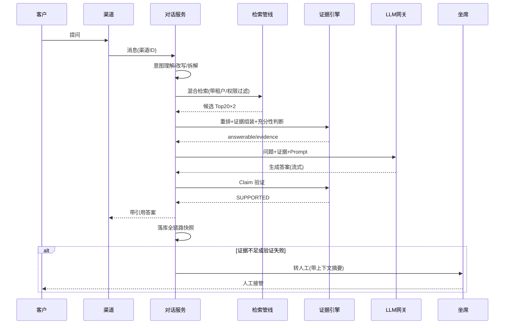
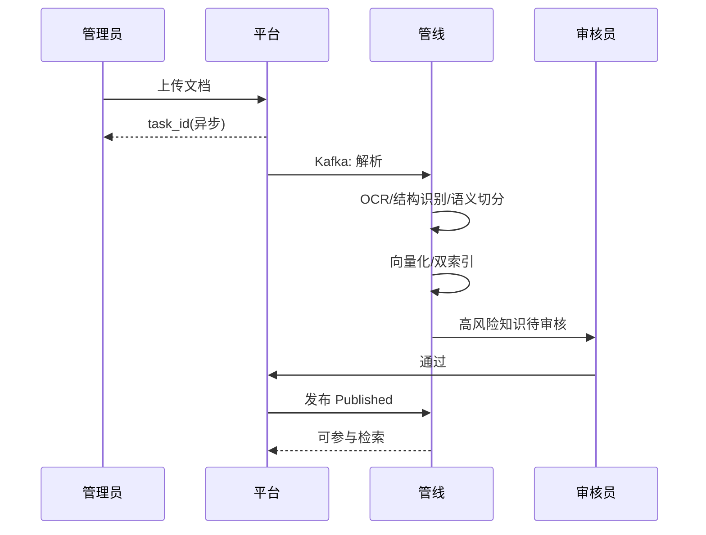
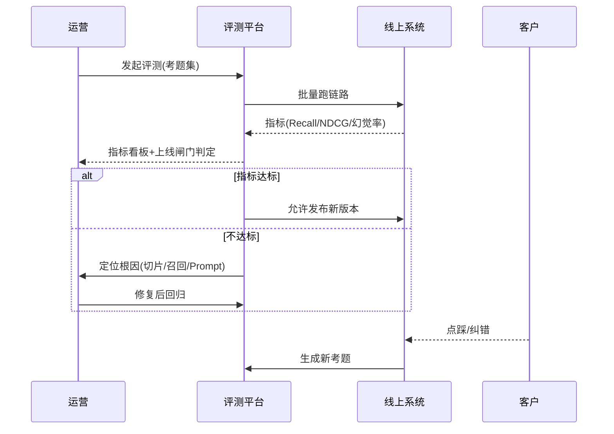

# PRD:企业级 AI 客服知识库系统

> 版本:v1.0(基于默认方案预生成) · 编写日期:2026-08-15
> 前置文档:《1-领域画像.md》《2-需求确认单.md》
> 本文档面向:产品、研发、测试、运营。业务规则全部带编号 BR-XXX 与来源追溯。

---

## 1. 项目背景与目标

### 1.1 业务背景

企业每天要回答大量重复客户问题(保修、退款、物流、发票…)。纯人工成本高、响应慢、口径不一;纯聊天机器人又容易"答非所问"甚至"一本正经地胡说"(幻觉)。本系统将**企业知识管理 + 智能检索 + 大模型生成 + 人工协同 + 评测治理**组合成一个平台:让 AI 答有把握的问题(且必须带可追溯证据),答不了的快速转人工,并且每次失误都能被追踪、评测、修正,形成持续变好的闭环。

### 1.2 八大闭环功能点(通俗讲解)

> 这是本文档的灵魂。系统不是"一个聊天窗口",而是以下 8 个闭环的组合。每个闭环都有"入口→过程→出口→反馈",缺一环就会出问题。

**闭环① 知识入库闭环(资料是怎么进大脑的)**
> 上传文档 → 解析/OCR → 语义切分 → 向量化 → 索引 → 审核 → 发布 → 参与检索
> 通俗讲:管理员把 PDF/Word/Excel 传上去,系统把文档"拆成一句句能查的片段"并打上语义指纹,高风险内容(价格、政策、法务)必须有人点头才生效。**闭环的关键**:发布后立刻能检索、未发布/已过期绝不参与检索。

**闭环② 问答服务闭环(客户提问怎么被答对)**
> 提问 → 语义理解 → 改写/拆解 → 混合检索 → 重排 → 证据引擎 → 生成 → Claim 验证 → 带引用输出
> 通俗讲:系统先"听懂"用户到底想问什么(比如"碎屏能免费修吗"→ 意图=保修),再从资料库捞出最相关的片段当"证据",让大模型照着证据写答案,最后逐句检查有没有胡说。**闭环的关键**:没有证据的答案一律不许发出去。

**闭环③ 人机协同闭环(AI 不行时人工怎么接住)**
> AI 尝试 → 证据不足/情绪激烈/多次失败 → 自动转人工(带上下文摘要) → 坐席接管 → 解决 → 客户反馈
> 通俗讲:AI 不是万能,系统负责在 AI 搞不定时"优雅地交棒",坐席打开工作台就能看到 AI 的完整建议和证据链,不用重新问一遍。**闭环的关键**:交接时上下文不丢。

**闭环④ 知识保鲜闭环(政策改了怎么办)**
> 新版本起草 → 审核 → 发布(旧版本自动过期) → 冲突检测 → 裁决 → 旧版本移出检索
> 通俗讲:售后政策一年改好几次,系统保证"只有最新版能答",旧表述要么自动失效、要么被发现冲突后由负责人裁决。**闭环的关键**:版本状态机 + 冲突检测。

**闭环⑤ 质量评测闭环(怎么知道 AI 答得好不好)**
> 标准考题集 → 自动评测(Recall@K/NDCG/幻觉率…) → 指标看板 → 上线闸门 → 不达标禁止发布
> 通俗讲:给系统"考试",考不过不许改版上线。考题来自真实客户问题+标准答案。**闭环的关键**:上线闸门是硬性的。

**闭环⑥ 反馈优化闭环(客户不满意怎么变成改进)**
> 客户点踩/纠错 → 生成新考题 → 纳入回归测试 → 定位根因(切片?召回?Prompt?) → 修复 → 重测通过
> 通俗讲:客户的每一次"不满意"都被收集起来变成新的考题,防止同样的问题再次发生。**闭环的关键**:反馈必须变成考题,考题必须回测。

**闭环⑦ Agent 业务执行闭环(AI 动手做事的安全通道)**
> 意图识别 → 选择工具 → 权限校验 → 走工作流 → 调用业务系统(查单/建工单/退款审批) → 结果回填 → 全程留痕
> 通俗讲:AI 想"查订单、建工单、申请退款"时,不能直接乱来:只读的可以直接查,要动钱的必须走审批流程。**闭环的关键**:AI 只做决策,执行权在受控工具和流程里。

**闭环⑧ 治理闭环(权限/审计/成本/租户)**
> 登录认证 → RBAC/ABAC 校验 → 操作留痕 → 越权拦截 → 审计查询 → 成本分摊与预算告警
> 通俗讲:谁在什么时候做了什么、AI 花了多少钱、哪个租户能看到什么,全部有记录、有边界。**闭环的关键**:全链路可追溯 + 强制隔离。

### 1.3 项目目标(可衡量)

| # | 目标 | 衡量方式 |
|---|------|---------|
| G1 | 首版上线时,AI 能覆盖 80% 高频售后问题 | 高频问题命中率 ≥ 80% |
| G2 | AI 回答必须可追溯 | 100% AI 直答带证据引用,幻觉率 ≤ 2% |
| G3 | 答不了的问题无缝转人工 | 转人工附带上下文,坐席重复询问率 ≤ 10% |
| G4 | 新版本上线前必须过评测闸门 | 回归通过率 100%(不达标不上线) |
| G5 | 客户负反馈形成改进闭环 | 负反馈 100% 转化为评测用例并纳入回归 |

### 1.4 成功指标

- AI 直答率 ≥ 85%、答案采纳率 ≥ 85%、检索命中率 ≥ 92%
- 平均响应:首 Token P95 < 1s
- 幻觉率 < 2%、知识发布后 24h 内可检索
- 越权访问 0 泄漏(全部拦截并告警)

---

## 2. 用户角色与权限矩阵

| 角色 | 说明 | 可访问的模块 |
|------|------|-------------|
| 终端客户 | 通过各渠道提问,不进入本系统后台 | 渠道对话(企微/网页/APP) |
| 客服坐席 | 处理对话,接管 AI 转交的会话 | 对话工作台、知识库(只读)、会话记录 |
| 知识管理员 | 上传与维护知识 | 知识平台(上传/解析/Chunk 编辑) |
| 审核员 | 把关高风险知识 | 知识审核、版本管理 |
| 质检/评测员 | 管理考题与评测 | 评测平台、对话记录(只读) |
| AI 平台管理员 | 模型、Prompt、工具、流程 | AI 运行时、Agent·流程、评测、成本 |
| 系统管理员 | 权限、审计、租户 | 治理平台全模块 |

**权限矩阵(角色 × 模块,✓=可访问 / 只读 / —=无)**

| 角色 | 知识平台 | 知识审核 | 检索 | 证据 | 对话工作台 | AI 运行时 | Agent·流程 | 评测 | 审计/成本 |
|------|---------|---------|------|------|-----------|----------|-----------|------|----------|
| 客服坐席 | 只读 | — | 只读 | 只读 | ✓ | — | 只读 | — | — |
| 知识管理员 | ✓ | 只读 | ✓ | — | — | — | — | — | — |
| 审核员 | 只读 | ✓ | — | — | — | — | — | — | — |
| 质检/评测员 | 只读 | — | ✓ | ✓ | 只读 | 只读 | — | ✓ | — |
| AI 平台管理员 | ✓ | — | ✓ | ✓ | — | ✓ | ✓ | ✓ | 只读 |
| 系统管理员 | ✓ | ✓ | ✓ | ✓ | ✓ | ✓ | ✓ | ✓ | ✓ |

---

## 3. 功能需求

| 模块 | 功能 | 功能描述 | 优先级 | 关联决策点 |
|------|------|---------|--------|-----------|
| 知识平台 | 知识库管理 | 创建/配置知识库(切分策略、Embedding 模型、权限边界、有效期) | P0 | → M1 |
| 知识平台 | 文档上传与任务化 | 支持 PDF/Word/Excel/PPT/图片/扫描件;上传即返回 task_id,后台异步处理 | P0 | → M1 |
| 知识平台 | 解析与结构识别 | Tika/PDFBox/POI 解析;识别章节/小节/表格/图片结构;扫描件 PaddleOCR | P0 | → M1 |
| 知识平台 | 语义切分 | 支持 Semantic/Parent-Child/Table/FAQ/Policy 多种切分策略 | P0 | → M1 |
| 知识平台 | 向量化与索引 | Embedding 生成向量;BM25 + 向量双索引;增量索引 | P0 | → M1 |
| 知识平台 | Chunk 管理 | 查看/编辑/禁用 Chunk,查看解析质量告警 | P1 | → M1 |
| 知识治理 | 版本管理 | Draft→Review→Published→Expired→Archived 全生命周期 | P0 | → M2, R1 |
| 知识治理 | 分级审核 | 高风险强制人工;低风险自动;价格双人复核 | P0 | → M2, R2 |
| 知识治理 | 冲突检测与裁决 | 新旧版本/同义条款冲突自动标记,负责人裁决 | P1 | → M2, R4 |
| 检索平台 | 语义理解 | 意图/实体/属性结构化抽取(如 intent=WARRANTY, product=X100 Pro) | P0 | → M3 |
| 检索平台 | Query 改写与拆解 | 生成多检索变体;复杂问题拆成子问题分别检索后合并 | P0 | → M3 |
| 检索平台 | 混合检索与重排 | BM25+向量并行召回,RRF 融合,重排取 Top5 | P0 | → M3 |
| 检索平台 | 权限过滤 | 检索结果强制 Tenant+Permission 过滤 | P0 | → M3, R3 |
| 证据平台 | 证据引擎 | 证据整理/去重/冲突检测/充分性判断,输出 answerable 与置信度 | P0 | → M4, R5 |
| 证据平台 | Claim 验证 | 生成后逐句断言比对,SUPPORTED 才放行 | P0 | → M4, R6 |
| 证据平台 | 引用与证据面板 | 答案带 [C1][C2] 引用,可展开原始 Chunk | P0 | → M4 |
| 对话工作台 | 多渠道接入 | 企业微信/钉钉/网页/APP/API 统一接入 | P0 | → M5 |
| 对话工作台 | AI 建议+人机协同 | 坐席查看 AI 建议、证据链、意图/实体/规则命中,一键采纳 | P0 | → M5, R11 |
| 对话工作台 | 转人工与接管 | 自动转人工(带上下文摘要)、坐席接管、会话记录 | P0 | → M5 |
| 对话工作台 | 客户画像 | 会员等级/在保状态/历史工单/情绪倾向 | P1 | → M5 |
| AI 运行时 | 模型网关 | 多模型统一接入:路由/降级/限流/超时重试/计量 | P0 | → M6, R13 |
| AI 运行时 | Prompt 管理 | 版本化、灰度、AB 对比、一键回滚 | P0 | → M6 |
| Agent·流程 | 工具注册表 | 注册 OpenAPI 工具,绑定权限与配额,调用可观测 | P0 | → M7, R8 |
| Agent·流程 | 规则引擎 | IF-THEN 硬规则兜底(保修/退款条件) | P0 | → M7, R7 |
| Agent·流程 | 工作流 | 退款/换机/赔偿等走流程引擎,人工审批、留痕回滚 | P0 | → M7, R9 |
| 评测与治理 | 评测任务 | 标准考题集自动评测,指标:Recall@K/Precision/MRR/NDCG/Faithfulness/幻觉率/成本 | P0 | → M8, R14 |
| 评测与治理 | 上线闸门 | 指标不达标禁止发布新版本 | P0 | → M8, R14 |
| 评测与治理 | 反馈收集 | 用户点赞/点踩/纠错;低命中分析;FAQ 候选沉淀 | P0 | → M8, R15, R12 |
| 评测与治理 | 权限管理 | RBAC 角色矩阵 + ABAC 属性策略 | P0 | → M8, R3 |
| 评测与治理 | 审计日志 | 全操作留痕(操作人/时间/IP/对象/结果),可导出 | P0 | → M8, R16 |
| 评测与治理 | 成本管理 | Token 计量,按模型/租户/场景分摊,预算告警 | P1 | → M8, N5 |
| 评测与治理 | 多租户 | 租户开通/隔离/数据互不可见 | P1 | → M8, R10 |
| 全局 | 链路追踪 | 每次问答全快照(理解/检索/证据/生成/成本),可重放 | P0 | → M8, R16, N4 |

---

## 4. 业务规则清单

| BR 编号 | 规则 | 详细说明 | 来源 |
|---------|------|---------|------|
| BR-001 | 文档上传异步化 | 上传仅登记文件元数据并返回 task_id;解析/切分/向量化/索引由消息队列串行处理,不阻塞用户;失败可重试,状态全程可见 | → M1 |
| BR-002 | 解析质量门禁 | 解析失败(含 OCR 置信度 < 阈值)进入"质量告警",人工复核前不进入下一步;重复文档按文件 hash 拦截 | → M1 |
| BR-003 | 切分策略映射 | 按文档类型自动选择切分策略:产品文档→Semantic;政策→Parent-Child;价目表→Table;FAQ→FAQ Chunk;条款→Policy Chunk | → M1 |
| BR-004 | 双索引一致性 | Chunk 发布后须同时写入 BM25 索引与向量索引;任一失败则整体回滚并告警 | → M1 |
| BR-005 | 版本状态机 | 知识版本仅 5 态:草稿→审核→已发布→已过期→已归档;检索过滤条件:状态=已发布 且 生效期包含当前时间 且 租户匹配 | → M2, R1 |
| BR-006 | 审核分级 | 政策/价格/法务类必须人工审核;FAQ/SOP 置信度≥0.85 可自动发布;价格变更双人复核;置信度<0.85 强制人工 | → M2, R2 |
| BR-007 | 检索权限过滤 | 检索链路强制执行:租户过滤(tenant_id=当前租户)+ 权限过滤(角色/部门/密级);越权 Chunk 计数并告警 | → M3, R3 |
| BR-008 | 版本冲突裁决 | 新旧版本同义条款表述不一致→标记冲突,进入"待裁决";裁决前按旧版本口径,且该知识点转人工优先 | → M2, R4 |
| BR-009 | 证据充分性判断 | 引擎输出 answerable/confidence/evidence 列表;confidence ≥ 0.75 允许作答;0.5~0.75 要求补充证据或转人工;<0.5 或存在冲突→禁止作答转人工 | → M4, R5 |
| BR-010 | Claim 验证放行 | LLM 输出拆分为断言,逐条与证据比对;全部 SUPPORTED 才输出;出现 UNSUPPORTED 重试最多 2 次,仍失败则禁止输出并转人工 | → M4, R6 |
| BR-011 | 硬规则引擎优先 | 保修/退款类配置 IF-THEN 规则(Drools);LLM 结论与规则冲突时以规则为准并记录偏差 | → M7, R7 |
| BR-012 | 工具权限分级 | 工具分三级:只读(Agent 直调)、写(需坐席确认)、资金(禁止直连,仅走工作流);每次调用记录参数与结果 | → M7, R8 |
| BR-013 | 敏感操作走流程 | 退款/换机/赔偿等动作必须创建工作流实例,经审批执行;流程实例与对话、证据关联可回溯 | → M7, R9 |
| BR-014 | 多租户强制隔离 | 所有核心表(文档/Chunk/会话/用户/策略/评测)携带 tenant_id;数据访问与检索强制按租户过滤;跨租户访问 0 容忍 | → M8, R10 |
| BR-015 | 转人工触发与交接 | 满足任一条件即转人工:证据不足、Claim 重试失败、情绪激烈、客户要求、规则标记;交接消息自动携带问题+AI 建议+证据链摘要 | → M5, R11 |
| BR-016 | 知识回写与 FAQ 沉淀 | 每周扫描零命中/低采纳会话,聚类高频问题生成 FAQ 候选,走审核后入库;已过期版本自动移出检索 | → M2, R12 |
| BR-017 | 模型路由与降级 | 网关按场景/租户/时段路由;主模型超时/失败自动降级;敏感场景(法务)强制本地模型且禁止降级出域 | → M6, R13 |
| BR-018 | 评测上线闸门 | 新版本上线必须通过:幻觉率≤2%、Faithfulness≥95%、Recall@5≥90%、Citation 准确率≥97%;任一不达标禁止发布 | → M8, R14 |
| BR-019 | 反馈→考题闭环 | 用户负反馈自动生成评测用例(问题+期望),纳入回归集;修复后必须回测通过 | → M8, R15 |
| BR-020 | 全链路留痕重放 | 每次问答保存快照:conversation_id/意图/改写/检索结果/重排/证据/prompt 版本/模型/token/时延/答案/反馈 | → M8, R16, N4 |
| BR-021 | 渠道统一接入 | 各渠道仅做协议适配,统一进入对话服务;渠道 ID 入会话元数据;渠道级限流 | → M5 |
| BR-022 | 采纳与接管留痕 | 坐席"采纳/驳回/接管"AI 建议均记入会话轨迹,作为评测与质检输入 | → M5 |

---

## 5. 数据模型

> 📌 **渲染说明**:下图是 Mermaid ER 图。若当前编辑器未渲染(显示为代码块或空白),**信息完全一致,请直接看下方「5.1 数据模型(表格版)」**;需要看图时,可用支持 Mermaid 的编辑器打开(Typora、VS Code + Mermaid 插件),或把下面代码粘贴到 [mermaid.live](https://mermaid.live) 查看。

```mermaid
erDiagram
    TENANT ||--o{ KNOWLEDGE_BASE : "拥有"
    TENANT ||--o{ USER : "包含"
    USER }o--o{ ROLE : "分配"
    KNOWLEDGE_BASE ||--o{ DOCUMENT : "包含"
    DOCUMENT ||--o{ DOC_VERSION : "版本"
    DOC_VERSION ||--o{ CHUNK : "切分"
    CHUNK ||--o{ EVIDENCE : "作为证据"
    SESSION ||--o{ MESSAGE : "包含"
    SESSION ||--o{ TRACE : "链路快照"
    EVIDENCE }o--o{ MESSAGE : "引用"
    FEEDBACK o|--|| MESSAGE : "针对"
    EVAL_TASK ||--o{ EVAL_CASE : "包含"
    TOOL_REGISTRY ||--o{ TOOL_CALL : "调用记录"
    WORKFLOW_INSTANCE o|--|| SESSION : "关联"

    TENANT { string tenant_id PK; string name; string plan }
    USER { string user_id PK; string tenant_id FK; string name; string role_ids }
    ROLE { string role_id PK; string name; string perms }
    KNOWLEDGE_BASE { string kb_id PK; string tenant_id FK; string name; string chunk_strategy; string embed_model; string status }
    DOCUMENT { string doc_id PK; string kb_id FK; string name; string type; string hash; string status; string owner; datetime updated_at }
    DOC_VERSION { string ver_id PK; string doc_id FK; string status; string effective_from; string effective_to; string reviewer }
    CHUNK { string chunk_id PK; string ver_id FK; string content; vector embedding; string metadata; string status }
    SESSION { string conv_id PK; string tenant_id FK; string channel; string user_id; string status; string intent }
    MESSAGE { string msg_id PK; string conv_id FK; string role; string content; string citations }
    EVIDENCE { string ev_id PK; string chunk_id FK; float confidence; string verdict; string trace_id }
    TRACE { string trace_id PK; string conv_id FK; json snapshot }
    FEEDBACK { string fb_id PK; string msg_id FK; string type; string note; string eval_case_id }
    EVAL_TASK { string task_id PK; string suite_id FK; string model; string prompt_ver; string status; json metrics }
    EVAL_CASE { string case_id PK; string question; string gold_answer; string gold_chunks; string source_feedback }
    TOOL_REGISTRY { string tool_id PK; string name; string openapi; string perm_level; string quota }
    TOOL_CALL { string call_id PK; string tool_id FK; string conv_id FK; string params; string result; string approval }
    WORKFLOW_INSTANCE { string wf_id PK; string conv_id FK; string type; string status; string auditor; json audit_trail }
    AUDIT_LOG { string log_id PK; string actor; string action; string object; string result; string ip; datetime time }
```

### 5.1 数据模型(表格版,任何编辑器都能显示)

**实体清单与关键字段**

| 实体 | 说明 | 关键字段 |
|------|------|---------|
| TENANT | 租户(SaaS 多租户隔离单位) | tenant_id(PK)、name、plan |
| USER | 平台用户(坐席/管理员/审核员等) | user_id(PK)、tenant_id(FK)、name、role_ids |
| ROLE | RBAC 角色 | role_id(PK)、name、perms |
| KNOWLEDGE_BASE | 知识库 | kb_id(PK)、tenant_id(FK)、name、chunk_strategy、embed_model、status |
| DOCUMENT | 原始文档 | doc_id(PK)、kb_id(FK)、name、type、hash、status、owner、updated_at |
| DOC_VERSION | 文档版本(5 态状态机) | ver_id(PK)、doc_id(FK)、status、effective_from、effective_to、reviewer |
| CHUNK | 知识片段(检索与证据的最小单位) | chunk_id(PK)、ver_id(FK)、content、embedding、metadata、status |
| SESSION | 会话 | conv_id(PK)、tenant_id(FK)、channel、user_id、status、intent |
| MESSAGE | 消息(含 AI 引用) | msg_id(PK)、conv_id(FK)、role、content、citations |
| TRACE | 链路快照(完整重放) | trace_id(PK)、conv_id(FK)、snapshot |
| EVIDENCE | 证据记录 | ev_id(PK)、chunk_id(FK)、confidence、verdict、trace_id |
| FEEDBACK | 用户反馈 | fb_id(PK)、msg_id(FK)、type、note、eval_case_id |
| EVAL_TASK | 评测任务 | task_id(PK)、suite_id(FK)、model、prompt_ver、status、metrics |
| EVAL_CASE | 评测用例(标准考题) | case_id(PK)、question、gold_answer、gold_chunks、source_feedback |
| TOOL_REGISTRY | 工具注册表(Agent 权限) | tool_id(PK)、name、openapi、perm_level、quota |
| TOOL_CALL | 工具调用记录 | call_id(PK)、tool_id(FK)、conv_id(FK)、params、result、approval |
| WORKFLOW_INSTANCE | 流程实例(工单审批) | wf_id(PK)、conv_id(FK)、type、status、auditor、audit_trail |
| AUDIT_LOG | 审计日志 | log_id(PK)、actor、action、object、result、ip、time |

**实体关系表**

| 实体 A | 关系 | 实体 B | 基数 | 说明 |
|--------|------|--------|------|------|
| TENANT | 拥有 | KNOWLEDGE_BASE | 1 : N | 一个租户下多个知识库 |
| TENANT | 包含 | USER | 1 : N | 租户下的所有用户 |
| USER | 分配 | ROLE | N : N | 一个用户可拥有多角色 |
| KNOWLEDGE_BASE | 包含 | DOCUMENT | 1 : N | 知识库下多份文档 |
| DOCUMENT | 版本 | DOC_VERSION | 1 : N | 一份文档多个历史版本 |
| DOC_VERSION | 切分 | CHUNK | 1 : N | 一个版本切出多个 Chunk |
| CHUNK | 作为证据 | EVIDENCE | 1 : N | 同一 Chunk 被多次引用为证据 |
| SESSION | 包含 | MESSAGE | 1 : N | 一个会话多条消息 |
| SESSION | 关联 | TRACE | 1 : 1 | 每次问答保存一份链路快照 |
| EVIDENCE | 引用 | MESSAGE | N : N | 一条消息可引用多条证据 |
| FEEDBACK | 针对 | MESSAGE | 1 : 1 | 每条反馈对应一条消息 |
| EVAL_TASK | 包含 | EVAL_CASE | 1 : N | 一个评测任务跑多条考题 |
| TOOL_REGISTRY | 产生 | TOOL_CALL | 1 : N | 一个工具被多次调用 |
| WORKFLOW_INSTANCE | 关联 | SESSION | 1 : 1 | 每个工单关联来源会话 |

## 6. 业务流程

### 6.1 问答服务闭环(端到端)



> **文字版流程**(图未渲染时阅读):
> ① 客户在渠道(企微/网页/APP)提问 → ② 对话服务做意图理解、Query 改写、复杂问题拆解 → ③ 检索管线执行混合检索(BM25+向量)并强制租户/权限过滤 → ④ 证据引擎重排 Top5、去重、冲突检测、充分性判断(answerable?) → ⑤ 通过后把"问题+证据+Prompt"交给 LLM 网关流式生成 → ⑥ 输出前逐句 Claim 验证:全部有据 → 带引用输出;任一断言无据 → 重新生成(最多 2 次),仍失败 → 转人工 → ⑦ 全程落库链路快照,可完整重放。

### 6.2 知识入库闭环



> **文字版流程**(图未渲染时阅读):
> ① 管理员上传文档 → 平台登记元数据并返回 task_id(上传不阻塞) → ② Kafka 异步管线:文档解析(Tika/PDFBox/POI)→ 扫描件 OCR(PaddleOCR)→ 结构识别(章节/表格/图片) → ③ 语义切分(按文档类型选策略)→ 向量化(BGE-M3)→ 双索引(BM25+向量) → ④ 高风险知识(Policy/价格/法务)进入人工审核 → ⑤ 审核通过 → 状态置为"已发布" → 立即参与检索,旧版本自动过期移出检索。

### 6.3 评测与反馈闭环



> **文字版流程**(图未渲染时阅读):
> ① 运营选择考题集发起评测 → ② 评测平台批量跑线上链路,自动计算指标(Recall@K / Precision / MRR / NDCG / Faithfulness / 幻觉率 / 成本) → ③ 上线闸门判定:全部达标 → 允许发布新版本;任一不达标 → 定位根因(切片过粗 / 召回不足 / Prompt 约束缺失 / 文档未更新) → ④ 修复后重跑回归,直到通过 → ⑤ 客户点踩/纠错 → 自动生成新考题 → 纳入下次回归(闭环⑥)。


---

## 7. 非功能需求

| 类别 | 要求 | 验收指标 | 关联决策点 |
|------|------|---------|-----------|
| 性能 | 在线对话并发与响应 | 峰值 300 并发,首 Token P95<1s,检索 P95<800ms,评测任务异步 | → N1 |
| 安全 | 认证/授权/审计/脱敏 | OAuth2/OIDC/JWT;RBAC/ABAC;全操作审计;会话与客户信息脱敏加密;等保二级起步 | → N2 |
| 可用性 | 高可用与降级 | 核心服务可用率 99.9%;模型故障自动降级;数据每日备份,可恢复 | → N3 |
| 可观测性 | 全链路监控 | OpenTelemetry 全链路 Trace;Prometheus 指标;Loki 日志;Grafana 看板;关键链路分阶段耗时可见 | → N4 |
| 成本 | 计量与预算 | 全量 Token 计量;按模型/租户/场景分摊;预算 80%/100% 告警;支持省钱降级策略 | → N5 |
| 扩展性 | 渠道与模型可插拔 | 新增渠道/模型不改核心代码;OpenAPI 接口文档(Swagger) | → N6 |

---

## 8. 验收标准

| 编号 | 关联功能 | 验收标准(可测试) |
|------|---------|-------------------|
| AC-001 | 文档上传入库 | 当管理员上传 100MB PDF 时,系统立即返回 task_id 且页面不阻塞,10 分钟内状态变为"已发布"且可被检索命中 |
| AC-002 | 版本隔离 | 当政策 V3 发布后,系统检索"碎屏保修"时,结果仅来自 V3,不包含已过期 V2 内容 |
| AC-003 | 审核分级 | 当 AI 抽取"换屏价格 ¥699"进入审核台时,系统标记"高风险·价格",必须 2 人复核通过后才可发布 |
| AC-004 | 权限过滤 | 当普通客服检索"法务条款"时,系统返回 0 条法务 Chunk,且审计日志记录一次"越权拦截" |
| AC-005 | 证据充分性 | 当问题检索置信度 0.4(< 0.5)时,系统禁止 LLM 作答并自动转人工,附证据不足原因 |
| AC-006 | Claim 验证 | 当 LLM 输出含无证据断言时,系统拦截并重新生成,重试 2 次仍无据则转人工,客户侧不出现无据内容 |
| AC-007 | 转人工交接 | 当会话触发转人工时,坐席端会话面板自动显示:原问题、AI 建议、证据链、客户画像摘要 |
| AC-008 | 规则引擎 | 当订单"购机 700 天+质量问题"提问时,系统命中规则 FREE_REPAIR 并据此作答,与 LLM 结论冲突时以规则为准 |
| AC-009 | 工具权限 | 当 Agent 尝试调用"申请退款"工具时,系统拒绝直连并引导创建退款工作流,需人工审批后执行 |
| AC-010 | 评测闸门 | 当新版本幻觉率 2.5%(>2%)时,系统拒绝发布该版本,并在评测报告标注未达标指标 |
| AC-011 | 反馈闭环 | 当客户对答案点踩后,系统 24h 内生成对应评测用例并纳入回归集,修复后重测通过 |
| AC-012 | 全链路重放 | 当运营按 conversation_id 查询时,系统可完整展示该问答的理解/检索/证据/生成/成本快照并支持导出 |

---

## 9. 里程碑建议

| 阶段 | 范围 | 交付物 | 建议周期 |
|------|------|--------|---------|
| 阶段 0 | 需求冻结 | 确认单 100% 确认、原型评审通过 | 1 周 |
| 阶段 1 | P0:知识平台+检索+证据+对话工作台 | 可演示的最小闭环(入库→问答→证据→转人工) | 6-8 周 |
| 阶段 2 | P0:知识治理+AI 运行时+评测闸门 | 可上线内测版(版本/审核/模型网关/评测) | 4-6 周 |
| 阶段 3 | P0/P1:Agent·流程+治理 | 业务工具/工作流/权限/审计/成本 | 4-6 周 |
| 阶段 4 | 全量回归+安全加固+试运行 | 生产版本 v1.0 | 2-4 周 |

## 10. 附录

### 10.1 术语表

见《1-领域画像.md》第 4 节(Chunk、RAG、幻觉、证据、Claim 验证、上线闸门等大白话解释)。

### 10.2 待确认事项(采用默认方案,存在风险)

| 决策点 | 默认方案 | 风险说明 |
|--------|---------|---------|
| M1~M8、R1~R16、N1~N6 | 见《2-需求确认单.md》 | 若真实业务量级/渠道/是否 SaaS 与默认不同,需调整对应设计与性能目标 |
| 具体并发量 | 300 并发(默认) | 若实际更高,需扩容与压测 |
| 多租户深度 | 支持 SaaS 级租户隔离 | 若仅内部使用,可简化租户维度 |
| 渠道清单 | 企微/钉钉/网页/APP | 需确认首期渠道优先级 |
| 业务系统对接 | 订单/物流/会员/工单(OpenAPI) | 需确认现有系统与接口人 |

### 10.3 研究来源清单

- 联网:亿捷云、PingCode、51CTO、合力亿捷、CSDN、Red-Gate(见领域画像第 5 节)
- 用户资料:《AI客服知识库系统.docx》(技术架构与平台划分,优先级最高)

### 10.4 决策点落地对照(覆盖率自检)

| 决策点 | 对应 BR |
|--------|--------|
| M1 | BR-001~004 |
| M2 | BR-005~006、BR-008、BR-016 |
| M3 | BR-007 |
| M4 | BR-009~010 |
| M5 | BR-015、BR-021~022 |
| M6 | BR-017 |
| M7 | BR-011~013 |
| M8 | BR-014、BR-018~020 |
| R1~R16 | 见第 4 节来源列 |
| N1~N6 | 见第 7 节关联决策点 |
